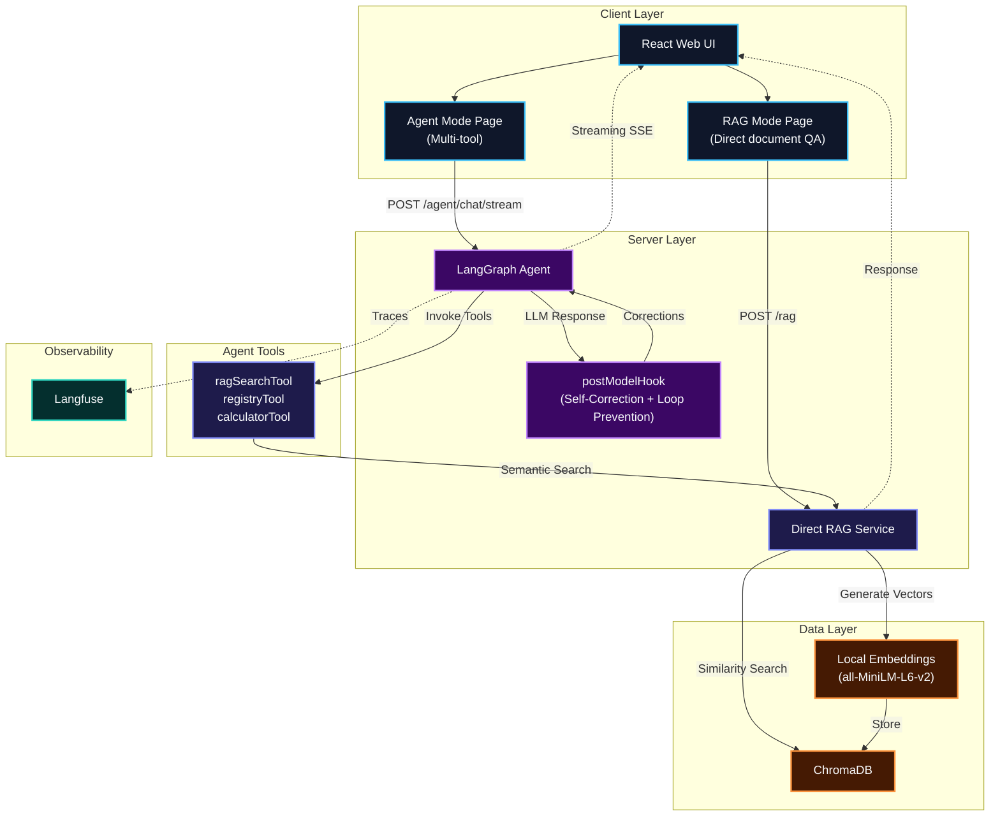

# Chatbot AI - Ethereal Intelligence v2.0

## 🚀 Quick Start

### Requirements
- Node.js 20+ (Strictly enforced via `.nvmrc` and `engines` for ONNX cross-platform compatibility)
- npm 10+
- Docker & Docker Compose (required for the ChromaDB Vector Database)
- Groq API Key (configured in `/backend/.env`)

### Installation

```bash
# Backend
cd backend
npm install

# Frontend
cd ../frontend
npm install
```

### Execution

There are two ways to run the Ethereal Intelligence infrastructure:

#### Method 1: Using Docker Compose (Recommended)
This approach automatically orchestrates the frontend, backend, and ChromaDB vector database flawlessly in the background using Linux Alpine/Slim sealed environments.

```bash
# From the root directory, rebuild and start all containers in detached mode:
docker-compose up -d --build
```
Your UI will be instantly available at **http://localhost:5173**.

* **Viewing Logs**: To watch logs for a specific service in real-time without locking your terminal, open a console in the root directory and run:
  - `docker-compose logs -f backend` 
  - `docker-compose logs -f frontend`
  - `docker-compose logs -f chromadb`
* **Shutting Down**: Cleanly stop everything using `docker-compose down`

#### Method 2: Hybrid Local Mode (Node.js + Docker ChromaDB)
If you prefer running Node.js locally without containerizing your Express/Vite servers, you still **must** run ChromaDB via Docker for the RAG system to work.

**Terminal 1 - ChromaDB Vector Database (Port 8000):**
```bash
docker run --name chatbot_chroma -p 8000:8000 -v $(pwd)/chroma_data:/chroma/chroma chromadb/chroma:latest
```

**Terminal 2 - Backend (Port 3001):**
```bash
cd backend
npm run dev
```

**Terminal 3 - Frontend (Port 5173):**
```bash
cd frontend
npm run dev
```

Open **http://localhost:5173** in your browser.

---

## 🏗️ Architecture & Technical Decisions

Ethereal is built as a robust, production-grade agentic assistant leveraging LangGraph, Express, and ChromaDB. 

Here is the **Simplified Architecture Flow** (ideal for a 2-minute interview overview):



<details>
<summary>🔍 Click to view the Detailed Architecture Diagram (Detailed Components & Full SSE Data Flow)</summary>



</details>

```mermaid
%%{init: {"flowchart": {"htmlLabels": false}}}%%
graph TD
    %% Styling
    classDef frontend fill:#0f172a,stroke:#38bdf8,stroke-width:2px,color:#f8fafc;
    classDef backend fill:#1e1b4b,stroke:#818cf8,stroke-width:2px,color:#f8fafc;
    classDef agent fill:#3b0764,stroke:#c084fc,stroke-width:2px,color:#f8fafc;
    classDef tools fill:#14532d,stroke:#4ade80,stroke-width:2px,color:#f8fafc;
    classDef database fill:#451a03,stroke:#fb923c,stroke-width:2px,color:#f8fafc;
    classDef obs fill:#042f2e,stroke:#2dd4bf,stroke-width:2px,color:#f8fafc;
    classDef highlight fill:#701a75,stroke:#f472b6,stroke-width:3px,color:#f8fafc;

    %% Layer 1: Client
    subgraph Client ["Client Layer (React)"]
        UI["React Web UI"]:::frontend
        RAGMode["RAG Mode Page\n(Direct QA)"]:::frontend
        AgentMode["Agent Mode Page\n(Multi-tool)"]:::frontend
        UploadForm["Upload Form"]:::frontend
        StreamHandler["SSE Stream Handler\n(Events: thinking, tool_call, stream, final_response)"]:::frontend
    end

    %% Layer 2: Server
    subgraph Server ["Server Layer (Express)"]
        API["Express Router"]:::backend
        RAGCtrl["RAG Controller"]:::backend
        AgentCtrl["Agent Controller"]:::backend
        UploadCtrl["Upload Controller"]:::backend
    end

    %% Layer 3: Orchestration (LangGraph)
    subgraph Orchestration ["Orchestration Layer (LangGraph)"]
        RAGPipe["Direct RAG Pipeline"]:::backend
        AgentGraph["LangGraph Orchestrator\n(createReactAgent)"]:::highlight
        MemorySaver["Checkpointer\n(MemorySaver + thread_id)"]:::agent
        PostHook["postModelHook\n(Self-Correction + Loop Breaking)"]:::highlight
        LLMWrapper["Groq Client Wrapper\n(Retries on tool-call errors)"]:::agent
        GroqAPI["Groq LLM\n(llama-3.3-70b-versatile)"]:::agent
    end

    %% Layer 4: Tools
    subgraph Tools ["Agent Tools"]
        RagSearchTool["ragSearchTool"]:::tools
        RegTool["registryTool"]:::tools
        CalcTool["calculatorTool"]:::tools
        RegistryServ["Registry Service"]:::backend
    end

    %% Layer 5: Data
    subgraph Data ["Data & Embeddings Layer"]
        LocalDocs["backend/documents/"]:::database
        LocalEmbed["Local Embeddings\n(all-MiniLM-L6-v2)"]:::database
        Chroma["ChromaDB"]:::database
    end

    %% Layer 6: Observability
    subgraph Observability ["Observability (Langfuse)"]
        CallbackHandler["Langfuse Callback Handler"]:::highlight
        LangfuseCloud["Langfuse Dashboard"]:::obs
    end

    %% === Connections ===

    UI --> RAGMode
    UI --> AgentMode
    UI --> UploadForm

    RAGMode -->|POST /rag| RAGCtrl
    AgentMode -->|POST /agent/chat/stream| AgentCtrl
    UploadForm -->|POST /upload| UploadCtrl

    RAGCtrl --> RAGPipe
    AgentCtrl --> AgentGraph
    UploadCtrl -->|Save files| LocalDocs
    UploadCtrl -->|Ingest| RAGPipe

    %% RAG Flow
    RAGPipe -->|Similarity Search| Chroma

    %% Agent Flow
    AgentGraph <-->|Thread Persistency| MemorySaver
    AgentGraph --> LLMWrapper
    LLMWrapper --> GroqAPI
    GroqAPI --> LLMWrapper
    LLMWrapper --> PostHook
    PostHook -->|Apply corrections| AgentGraph

    %% Tool execution
    AgentGraph --> RagSearchTool
    AgentGraph --> RegTool
    AgentGraph --> CalcTool

    RagSearchTool --> RAGPipe
    RegTool --> RegistryServ
    CalcTool --> CalcTool

    %% Data ingestion
    RAGPipe -->|Load & Vectorize| LocalEmbed
    LocalEmbed -->|Store| Chroma
    RAGPipe -->|Re-ingest on startup| LocalDocs

    %% Observability
    AgentGraph -.->|Callbacks| CallbackHandler
    CallbackHandler -.->|Traces| LangfuseCloud

    %% Streaming (CORREGIDO)
    AgentGraph -.->|Streaming SSE| StreamHandler
    StreamHandler -.->|Update UI| UI
    RAGPipe -.->|Response| UI

    %% Styling
    class UI,RAGMode,AgentMode,UploadForm,StreamHandler frontend;
    class API,RAGCtrl,AgentCtrl,UploadCtrl,RAGPipe,RegistryServ backend;
    class AgentGraph,MemorySaver,PostHook,LLMWrapper,GroqAPI agent;
    class RagSearchTool,RegTool,CalcTool tools;
    class LocalDocs,LocalEmbed,Chroma database;
    class CallbackHandler,LangfuseCloud obs;
```

### 🔑 Key Technical Decisions & Resilience Mechanisms

To bridge the gap between prototype and production readiness, we implemented several key safety patterns in the backend:

1. **`postModelHook` for Agent Self-Correction & Loop Breaking**:
   - **Alias Mapping**: Prevents errors when the LLM hallucinates tool names (e.g., mapping `calc`, `math` to `calculator_tool`).
   - **Arguments Sanitization**: Normalizes cases where Groq calls a tool with a plain string instead of the structured JSON schema (e.g. mapping `"10*5"` to `{expression: "10*5"}`).
   - **Loop Breaking**: Detects if the agent tries to repeatedly call the same tool with the exact same arguments in a single conversation. If a loop is caught, it clears the tool calls list and falls back to using the previous tool output to formulate a text response.
2. **Groq LLM Client Wrapper for Retry Logic**:
   - Groq sometimes returns a `400 BadRequestError` (with messages like `tool_use_failed` or `Failed to call a function`) due to formatting quirks. We wrapped the `ChatGroq` client to intercept these errors and automatically retry up to 3 times before failing.
3. **Local Embedding Generation**:
   - Rather than relying on paid OpenAI/Cohere API endpoints, the backend generates document embeddings locally using HuggingFace's `@xenova/transformers` with the `all-MiniLM-L6-v2` model running directly in Node.js. This ensures zero API costs for RAG operations.
4. **SSE Streaming for Real-Time Interaction**:
   - Utilizing Server-Sent Events (SSE) to stream tokens as they are generated, along with `thinking` and `tool_call` state updates, giving the user instant feedback on the agent's reasoning steps.
5. **Full Observability with Langfuse**:
   - The agent service is fully instrumented with the `langfuse-langchain` SDK. It records all traces, sessions (mapped via thread IDs), latency metrics, tool execution details, and LLM costs.
6. **Thread-Persistent Memory**:
   - Configured with LangGraph's `MemorySaver` checkpointer, enabling persistent, thread-safe session history across restarts.

---

## 📋 Available Scripts

### Backend (`/backend/package.json`)
- `npm start` - Runs with Node.js (recommended)
- `npm run dev` - Alias for `npm start`
- `npm run dev:watch` - Runs with nodemon (requires local nodemon installation)

### Frontend (`/frontend/package.json`)
- `npm run dev` - Starts development server (Vite)
- `npm run build` - Builds for production
- `npm run preview` - Previews build

---

## 🔧 Configuration

### Backend (.env)
```
GROQ_API_KEY=your_api_key_here
PORT=3001
```

### API Endpoints

#### GET `/`
Server status page (static HTML)

#### GET `/health`
Checks connection status
```json
{
  "status": "ok",
  "server": "running",
  "groqReady": true,
  "apiKeyConfigured": true,
  "timestamp": "2024-03-24T10:00:00.000Z"
}
```

#### POST `/chat`
Sends a message and receives Groq response
```bash
curl -X POST http://localhost:3001/chat \
  -H "Content-Type: application/json" \
  -d '{"message":"Hello, how do you work?"}'
```

Response:
```json
{
  "reply": "I am an artificial intelligence interface..."
}
```

---

## 🎨 UI Features

- **Ethereal Design**: Glassmorphism with blur effects
- **Dark Theme**: Custom color scheme with cyan accents (#59e7fc)
- **Smooth Animations**: Fade-in, bounce, transitions
- **Responsive**: Mobile-first design
- **Accessibility**: Improved contrast, clear labels

---

## 🐛 Troubleshooting

### Backend doesn't work but I can start it

1. **Verify Groq initialized:**
   ```bash
   # Should show ✅ in output
   npm start
   ```

2. **Test health endpoint:**
   ```bash
   curl http://localhost:3001/health
   ```

### Frontend doesn't connect to Backend

1. **Verify CORS:** Backend has CORS enabled for all origins in development
2. **Verify ports:**
   - Backend: `http://localhost:3001`
   - Frontend: `http://localhost:5173`
3. **Check browser Console:** F12 > Console to see errors

### ChromaConnectionError: Failed to connect to chromadb

1. **Database is Off**: Your backend likely threw an `Upload Error` or `ChromaConnectionError` because ChromaDB isn't running. Ensure your vector database container is spun up (`docker-compose up chromadb` or `docker run ... chromadb/chroma`).
2. **Anonymous Volumes Caching Old Modules**: If Docker Compose is throwing a missing package error (like `@huggingface/transformers`), or Alpine throws an `ld-linux` linking error on `onnxruntime`, try resetting your internal `node_modules` anonymous volumes by tearing everything down completely with `docker-compose down -v` and rebuilding via `docker-compose up --build`.

### API Key Error

1. Verify that `.env` in `/backend/` has the correct API Key
2. Restart the backend after changing `.env`

---

## 📞 Support

To report issues:
1. Check terminal logs
2. Test the `/health` endpoint
3. Verify that Groq is connected

---

**Version:** 2.0  
**Last updated:** March 24, 2026
